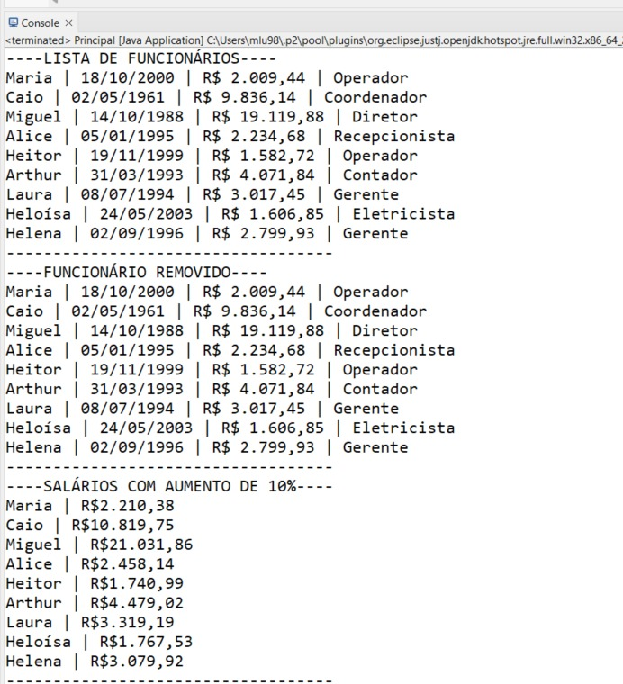
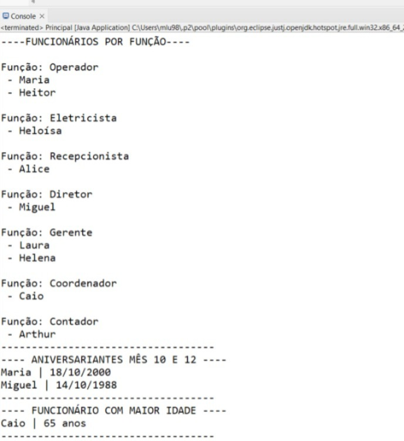
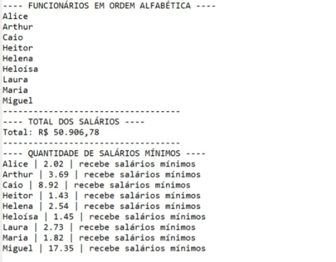

# Teste Prático Iniflex

Projeto desenvolvido em **Java** para resolução do teste prático da Iniflex, com foco em Programação Orientada a Objetos, manipulação de coleções, datas e valores monetários.

## Objetivo do projeto

O sistema mantém uma lista de funcionários e executa as operações solicitadas no desafio, incluindo cadastro, remoção, reajuste salarial, agrupamento por função, filtros por data de nascimento, ordenação e cálculos com salários.

## Estrutura do projeto

```text
src/
├── application/
│   └── Principal.java
└── entities/
    ├── Pessoa.java
    └── Funcionario.java
```

### Pessoa

A classe `Pessoa` representa os dados básicos de uma pessoa:

- `nome` do tipo `String`;
- `dataNascimento` do tipo `LocalDate`.

### Funcionario

A classe `Funcionario` herda de `Pessoa` e acrescenta:

- `salario` do tipo `BigDecimal`;
- `funcao` do tipo `String`.

O uso de `BigDecimal` permite trabalhar com valores monetários sem depender de tipos de ponto flutuante.

### Principal

A classe `Principal` contém o método `main` e executa as regras do desafio. Os dados iniciais dos funcionários são organizados em uma matriz `String[][]` e convertidos em objetos `Funcionario`.

## Funcionalidades implementadas

### Cadastro dos funcionários

Os funcionários são adicionados a uma `List<Funcionario>`. As datas são convertidas para `LocalDate` com `DateTimeFormatter` e os salários são convertidos para `BigDecimal`.

### Remoção de funcionário

O funcionário João é removido da lista utilizando `removeIf`.

### Formatação de datas e salários

As datas são apresentadas no formato:

```text
dd/MM/yyyy
```

Os valores monetários são exibidos no padrão brasileiro, com ponto como separador de milhar e vírgula como separador decimal.

### Reajuste salarial

Todos os funcionários recebem aumento de **10%**. O cálculo utiliza `BigDecimal` e mantém duas casas decimais.

### Agrupamento por função

Os funcionários são agrupados de acordo com a função utilizando:

```java
Map<String, List<Funcionario>>
```

A criação das listas dentro do `Map` é feita com `computeIfAbsent`.

### Aniversariantes dos meses 10 e 12

O programa percorre a lista e verifica o mês da data de nascimento utilizando `getMonthValue()`, exibindo os funcionários que fazem aniversário em outubro ou dezembro.

### Funcionário com maior idade

O funcionário mais velho é identificado comparando as datas de nascimento com `LocalDate.isBefore()`.

A idade é calculada com:

```java
Period.between(dataNascimento, LocalDate.now()).getYears()
```

### Ordenação alfabética

A lista é ordenada pelo nome dos funcionários utilizando:

```java
Comparator.comparing(Funcionario::getNome)
```

### Total dos salários

Os salários, já com o reajuste aplicado, são acumulados utilizando `BigDecimal`.

### Quantidade de salários mínimos

O programa considera o salário mínimo de **R$ 1.212,00** e calcula quantos salários mínimos cada funcionário recebe, apresentando o resultado com duas casas decimais.

## Conceitos e recursos utilizados

- Java
- Programação Orientada a Objetos
- Herança
- Encapsulamento
- `ArrayList`
- `Map` e `HashMap`
- `BigDecimal`
- `LocalDate`
- `Period`
- `DateTimeFormatter`
- `NumberFormat`
- `Comparator`
- Expressões lambda
- `removeIf`
- `computeIfAbsent`

## Resultado da execução

### Cadastro, remoção e reajuste salarial



### Agrupamento, aniversariantes e funcionário com maior idade



### Ordenação, total dos salários e salários mínimos



## Como executar

1. Clone ou baixe este repositório.
2. Importe o projeto em uma IDE Java, como o Eclipse.
3. Verifique se o JDK está configurado no projeto.
4. Abra `src/application/Principal.java`.
5. Execute a classe como **Java Application**.
6. Os resultados serão apresentados no console.

## Organização das imagens

Para que as imagens deste README apareçam corretamente no GitHub, mantenha esta estrutura na raiz do repositório:

```text
README.md
images/
├── console-parte-1.png
├── console-parte-2.png
└── console-parte-3.png
```

## Autor

**Marcos Antônio Sálvio Lú**
